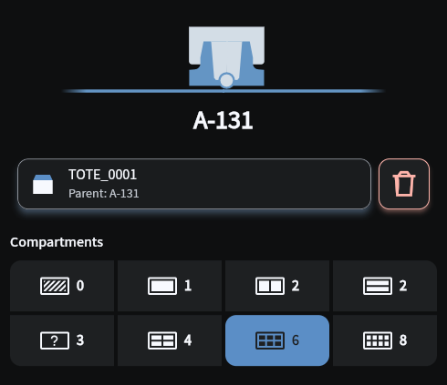
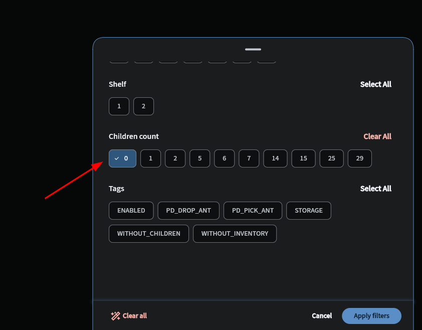
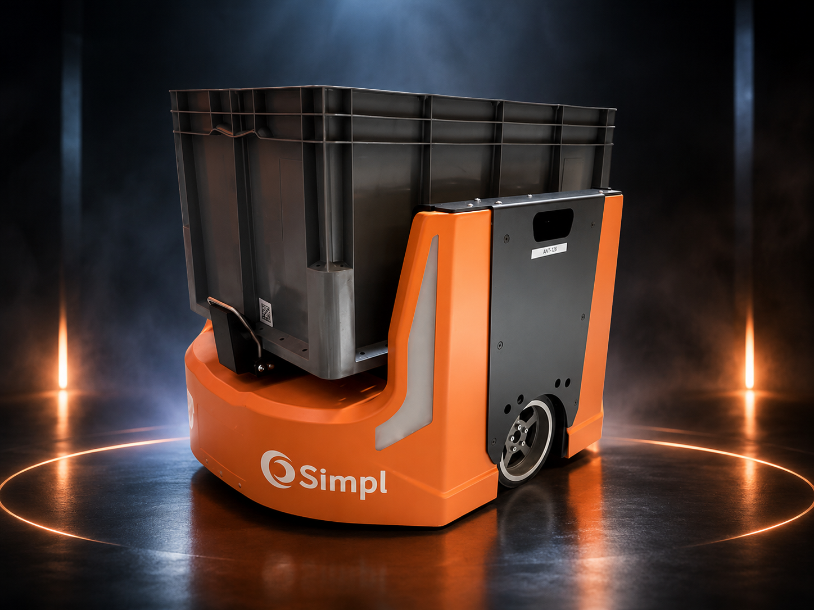
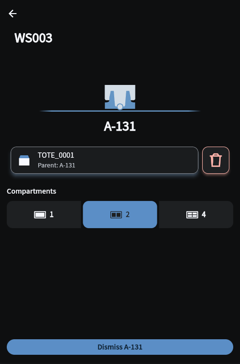
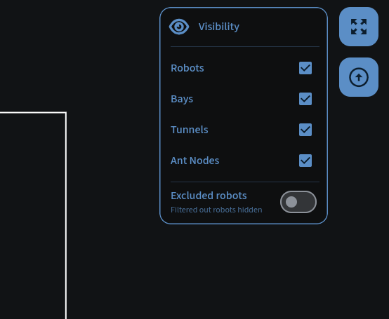
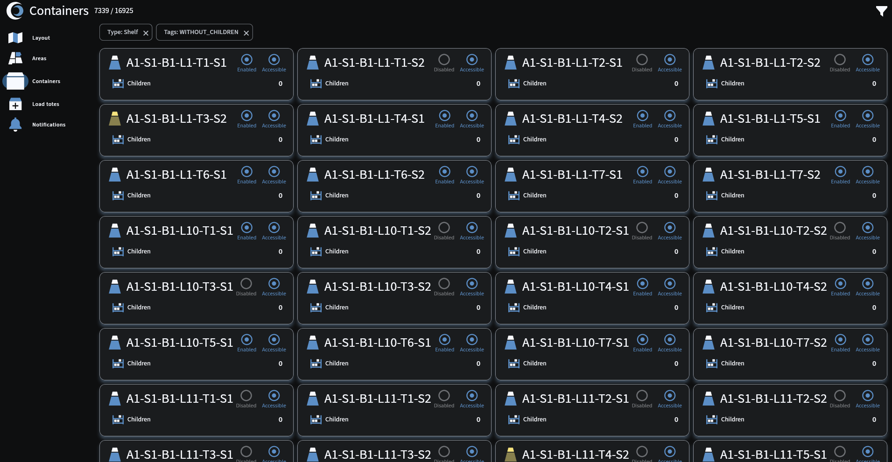
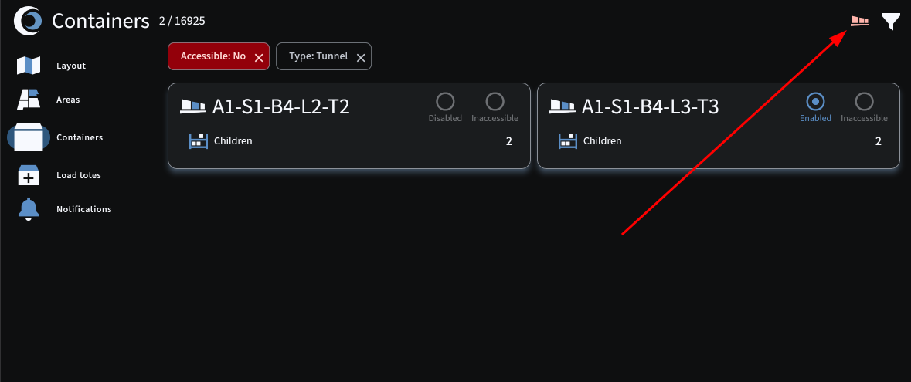

# SIMPLware Release Notes

## In scope
- SIMPL UIs: Flo and Puls
- SIMPL Kotlin and Python backend services
- SIMPL Kotlin, Python, and Flutter SDKs
- Robot firmware

## Out of scope
- Software infrastructure
- Robot mechanics
- Layout and physical infrastructure

> **NOTE**: SIMPL ticket numbers look like this: [#1234]

# v3.0.3 - Ant traffic school

2026.07.20

## ✨ Shiny new stuff
Sorry, just the shiny old stuff for now 〰️

## ⏫ Level-ups
### 🌭🍔 Hot dogs and hamburgers
Flo now supports both **hot dog** and **hamburger** tote compartment configurations.

- Flo also supports fully **empty totes** without compartments, **single compartment** totes, as well as **quad**, **hex**, and **oct** compartment configurations
- Custom compartment icons during tote induction are also **bigger** so it's easier to see which compartment configuration you are selecting
- Flo will also **remember** the last compartment selection you used **by workstation** until you restart the app

## 🪲 Bug fixes
- Ants should no longer collide with Mantises while the Mantis is extracting [#7763]
- Ants should no longer fail tasks due to "Failed to find transition position for request" [#7473] [#7741]
- Ants should no longer periodically stop while driving long distances [#7743]
- Ants no longer get close enough to gridlock each other in certain cases [#7713] [#7756]
- Empty Ants should now distribute more evenly between multiple workstations based on WIP calculations [#7749] [#7729]
- Ants should no longer get stuck at the position just before the presentation position in a workstation [#7750] [#7767]
- Ants carrying totes with compartments other than the compartment types currently being requested by the workstation should now auto-dismiss after presenting [#7755] [#7775]
- Dynamic Pick Stations should now request the right number of totes and Ants [#7709]
- Totes that already exist in the system can no longer be teleported during Flo Tote Induction unless they are in the Orphanage [#7721] [#7723]
- The Flo container teleport destination selection bottom sheet should now show all eligible bays during selection [#7279]
- After creating, deleting, and re-creating a tote during Flo Tote Induction, tote compartments no longer inaccurately show DELETED in Flo [#7667]
- During Flo Tote Induction, Flo no longer inaccurately reports that an empty Ant is carrying a tote (the previous tote the Ant inducted) [#7777]

## 🤖 Firmware updates
No firmware updates required! ✅

## 🧪 Development improvements
- DPS environment variables have been corrected in Helm [#7794]

## 🚧 Known issues
- The order of operations in Flo Tote Induction is a little wonky [#7727]
- Flo Tote Induction allows you to delete a tote on an Ant after dismissing the Ant [#7684]
- Compartment-specific demand shows as "Requesting empty totes" in Flo [#7800]
- Workstations sometimes show as Off in Flo when Tote Induction is enabled [#7779]
- Sometimes Flo Tote Induction is stuck in a Pending status [#7766]
- Ants sometimes take longer than expected to start moving again after dropping off a tote with inventory into a P&D [#7744]

## 🚀 Deployment notes
- **New robot firmware?**: YES
- **New Flo APK?**: YES
- **New backend services**: NONE
- **Updated backend services**: AMS, CVS, DPS, GAS, IMS, LM, RCS, RES, RMS, RQS, SASG
- **Database migrations**: NONE
- **Downtime requirements**: 30 minutes of full system downtime

For the **new compartment icons** to work correctly in Flo, you'll need to make sure your container templates are configured with the following **valid labels**. Anything outside of these labels will show a ? compartment icon in Flo.
- EMPTY_TOTE
- STUDIO
- HAMBURGER
- HOTDOG
- QUAD
- HEX
- OCT

# v3.0.2 - Hot dogs for the children

2026.07.16

## ✨ Shiny new stuff
Sorry, just the shiny old stuff for now 〰️

## ⏫ Level-ups
### 🌭 Added support for "hot dog" totes [#7716]
SIMPLware now supports totes with 2 long rectangular compartments.

- See [Known issues](#-known-issues) below

### #️⃣ Children count filter in Flo
Flo has a new children count filter on the Containers screen, allowing users to filter containers by their children count.

## 🪲 Bug fixes
- Reduced the number of times Ants need to be cleared while stalled in the Storage area [#7730]
- Ants no longer get close enough to gridlock each other (still) [#7738]
- Ants no longer stay unreasonably far away from each other (better command shortening) [#7711]
- Ant tasks no longer fail with "Failed to find transition position for request" errors when entering workstations [#7710]
- Flo no longer reports "Depositing to undefined" on some Ant deposit tasks [#7502]
- The time it takes for an Ant to start moving again after dropping off a tote with inventory into a P&D has been reduced [#7735]
- Pressing Enter after entering a tote label on the Containers screen now immediately searches for the tote instead of changing focus to the Find container button [#7659]
- The deletion of totes during Flo Tote Induction now properly updates other devices monitoring the Tote Induction Operations screen [#7665]

## 🤖 Firmware updates
No firmware updates required! ✅

## 🧪 Development improvements
Nothing to see here 🙈

## 🚧 Known issues
Ghost town 👻

## 🚀 Deployment notes
- **New robot firmware?**: NO
- **New Flo APK?**: YES
- **New backend services**: NONE
- **Updated backend services**: AMS, CVS, DPS, GAS, IMS, RES, RVS, SASG
- **Database migrations**: NONE
- **Downtime requirements**: 30 minutes of full system downtime

# v3.0.1 - Couple bug fixes

2026.07.15

## ✨ Shiny new stuff
Sorry, just the shiny old stuff for now 〰️

## ⏫ Level-ups
Steady as she goes 🚢

## 🪲 Bug fixes
- Ants no longer get close enough to gridlock each other [#7677]
- Totes are now able to be correctly picked up from DPS workstations [#7688]
- Ants no longer get stuck when entering DPS workstations [#7700]
- Ants now correctly choose their closest transition nodes [#7676]
- MQTT connectivity fix for Puls analytics [#7689]
- Some SENSOR_INITIAL_STATE_CHECK_FAULT failures have been resolved [#7663]

## 🤖 Firmware updates
No firmware updates required! ✅

## 🧪 Development improvements
Nothing to see here 🙈

## 🚧 Known issues
Ghost town 👻

## 🚀 Deployment notes
- **New robot firmware?**: NO
- **New Flo APK?**: NO
- **New backend services**: NONE
- **Updated backend services**: AMS, DPS, LM, POP, PUT, RES
- **Database migrations**: NONE
- **Downtime requirements**: 30 minutes of full system downtime

# v3.0.0 - Enter: Ant 3.0

2026.07.13

## ✨ Shiny new stuff
### 🏎️ Ants just got a lot faster [#6137]
Introducing, the new super speedy Ant management stack!

- The **time Ants have to wait** to be told what to do next has been dramatically reduced to **near zero**
- The new **Ant Management Service (AMS)** combines the functionality of robot **tasks**, **actions**, and **commands** into one, super fast, infinitely scalable, Ant conductor!
- AMS creates Ant "actors" under the hood that manage each Ant individually in memory
  - Ants are assigned to instances of AMS during deployment
  - This allows AMS to handle an **unlimited** number of Ants; the only limitation is the hardware you throw at it!
- Ant 3.0 **firmware** is more **autonomous**
  - Previously, commands were deterministic and required a final velocity to be passed
  - This resulted in commands constantly being planned and overwritten as an Ant progressed through a task
  - With the new stack, commands are planned for tasks by **appending** new commands, drastically reducing the number of commands that need to be sent to the Ants
- **Layout Manager (LM)** has been overhauled
  - LM is no longer simply an AutoCAD translator, it is a fully fledged **path planning powerhouse**!
  - Layout creation now has more accurate graph traversal according to AutoCAD properties
  - Valid orientations for traffic control are now read directly from the AutoCAD import, improving **path planning efficiency**
- **Reservation Execution Service (RES)** is a new service that exclusively handles the creation, management, and validation of **reservations** for all robots
  - Reservation management is now fully in-memory, making it **lightning fast**!

### 🗃️ Optimize product footprint with tote compartments! [#6699]
SIMPLware now enables storing many **different products** in a **single tote**!

- **Container templates** can be added to the system to configure tote compartments in a variety of ways
- Tote **orientations are tracked** as totes move around the system to enable optimized presentation at GTP workstations

### ➕ Induct totes with Flo! [#7017]
Flo has a new **Tote Induction screen** which allows users to easily induct totes into the system from GTP workstations!

- From the **Areas screen**, select a workstation then press the **Play button** in the Tote Induction section to start requesting empty Ants to the workstation
- With Tote Induction enabled, tap the **Tote Induction card** to enter the Tote Induction Operations screen
- While on the Tote Induction Operations screen, Flo will walk you through the process of adding new totes into the system
  - Simply **scan both labels** on the tote, select your **compartment** configuration, then press the **Ant dismiss** button or scan the Ant dismiss **QR code** to send the Ant away and load your next tote!

## ⏫ Level-ups
### 👁️ Flo layout visibility [#7560] [#7559] [#7527]
The Flo Layout screen has a new expandable **visibility menu**!

- Tap the **eyeball icon** on the Layout page to expand or collapse the new menu
- With the new menu, you can show/hide Robots, Bays, Tunnels, and Ant Nodes in the layout
- That's right, I said **Tunnels**! Inaccessible and disabled tunnels now render on the Layout screen too!
- There is also an **"Excluded robots" switch**, which, when enabled, will display all robots in the layout, even if they are **filtered out** on the robot card list!

## 🪲 Bug fixes
- Mantis homing code capture now starts correctly [#7428] [#7503]
- Totes can now be successfully picked up and dropped off at DPS stations [#7156] [#7664] [#6390] [#6731]
- Inventory updates are now processed faster [#7225]
- Workstations no longer sometimes request an incorrect number of empty totes or robots [#7463] [#7413]
- Shelf offsets are now collected more accurately [#7628]
- Ants now deposit to the closest available P&D locations [#7600]
- Offline robots turn grey in Flo [#7566]
- Flo's Areas screen and Workstation Detail screen now show accurate, up-to-date information for Areas [#7557]
- Bays on Flo's Layout page now render with the correct orientation on all layouts [#7274]
- Empty Ant incoming transfers now show correctly in Flo's Area Detail page [#7347]
- Flo no longer shows an incorrect container enabled/disabled state sometimes [#7500]

## 🤖 Firmware updates
### Mantis 2.5
- NXP: `v1.11.1-1-gb56fc09`
- Wormhole: `2.1.6`
- ALL-CAN 4: `f1a3258`
- ALL-CAN 8: `a903e43`
- Arm motor: `25072501`
- Finger motor: `v33.5`
- Foot motor: `3457`
- Scanner: Unknown [#7801]

### Ant 3.0
- NXP: `v0.13.0-5-g9290418`
- Wormhole: `2.1.6`
- ALL-CAN 4: `cf2697e`
- Mover motor: `26011601`
- Lifter motor: `26031501`
- Scanner: `V1.003.0001.1.R.20250924-1894`

## 🧪 Development improvements
- Modernization of the ACAR service; converted to the SIMPL SDK [#6055]
- Modernization of the CRS service; converted to the SIMPL SDK [#3496]
- Modernization of the AVS service; converted to the SIMPL SDK [#5872]
- Our analytics platform now collects more on-site data for analysis [#7617]
- Various service changes to support the new robot tasking stack [#6700] [#7009] [#7015]
- Firmware changes to support the new robot tasking stack [#6896]
- Improved automated testing in QA [#6355]
- RAS now publishes success/failure Kafka message for robot mode change requests [#7191]
- New Kafka topics for configuring GASConfig and GASState [#6850]
- SIMPL SDK now supports Mantis containers [#7124]
- Tagging of inaccessible tunnels can now be turned off via an SASG env var [#7526]
- The state of robot queues is now exportable via a new IOCS API and internal Kafka API [#7593]
- RAS and GAS consume Kafka messages faster [#7616] [#7512]
- URS service has been deprecated [#7232] [#7224]
- Patching of existing objects in Redis has gotten faster when writer ports in the SIMPL SDK opt-in to patching [#7223]
- New Simpl Spring Redis Periodic SDK library uses Redis to help services coordinate periodic reconciliation across multiple replicas [#7109]
- RVS is now horizontally scalable [#7180]
- RAP service helps debug onboard robot issues by automatically pushing robot logs to the cloud whenever a robot fails a task [#6320]
- Flo now has a new debugging menu to enable additional logging at runtime accessible on desktop with Cmd/Ctrl+Shift+D
- RVS now throws out stale robot status updates at startup [#7415]
- Flo now shows an in progress indication while Mantis bay assignment changes are processing [#7393]

## 🚧 Known issues
Ghost town 👻

## 🚀 Deployment notes
- **New robot firmware?**: YES
- **New Flo APK?**: YES
- **New backend services**: AMS, DPS, RES
- **Updated backend services**: ACAR, AVS, CRS, CTB, CTS, CVS, GAS, GDS, IMS, ITS, LM, LVS, RAP, RAS, RMS, RQS, RSS, RVS, SASG, SOS
- **Database migrations**: YES
- **Downtime requirements**: 1 hour of full system downtime

# v2.1.2 - More successful Mantis tasks

2026.05.20

## ✨ Shiny new stuff
Sorry, just the shiny old stuff for now 〰️

## ⏫ Level-ups
### ↕️ More successful Mantis tasks
Mantises will now shift up and down vertically to find the correct arm placement when extracting and depositing totes, increasing the likelihood of completing tasks successfully.

## 🪲 Bug fixes
The exterminator is out of town 🐛

## 🤖 Firmware updates
No firmware updates required! ✅

## 🧪 Development improvements
Nothing to see here 🙈

## 🚧 Known issues
Ghost town 👻

## 🚀 Deployment notes
- **New robot firmware?**: YES
- **New Flo APK?**: NO
- **New backend services**: NONE
- **Updated backend services**: NONE
- **Database migrations**: NONE
- **Downtime requirements**: NONE

# v2.1.1 - Homing codes & container tags

2026.05.20

## ✨ Shiny new stuff
Sorry, just the shiny old stuff for now 〰️

## ⏫ Level-ups
### 🞋 Mantis homing code capture overriding [#6727]
Mantis homing code capture now allows for re-capturing coordinates for existing homing codes.

## 🪲 Bug fixes
- Container tags are now correctly added to newly created containers [#6735]

## 🤖 Firmware updates
No firmware updates required! ✅

## 🧪 Development improvements
Nothing to see here 🙈

## 🚧 Known issues
Ghost town 👻

## 🚀 Deployment notes
- **New robot firmware?**: NO
- **New Flo APK?**: NO
- **New backend services**: NONE
- **Updated backend services**: CTB
- **Database migrations**: NONE
- **Downtime requirements**: NONE

# v2.1.0 - Revenge of the backend

2026.03.27

## ✨ Shiny new stuff
### ⤵️ New WorkstationDemand API [#5873]
Get exactly what you need at your workstation with the new `WorkstationDemand` API!

- `WorkstationDemandUpsert` messages are produced to communicate the **entirety** of Workstation demand
- Each `WorkstationDemandUpsert` message contains an **exhaustive** set of `WorkstationDemands` for the specified Workstation
- Any previously existing `WorkstationDemands` for the specified workstation that are not included in the new `WorkstationDemandUpsert` message will be considered **removed** and will **no longer be active**
- **Multiple types** of `WorkstationDemands` can be included in a single `WorkstationDemandUpsert` message (e.g., `ProductPack` demand and `EmptyContainer` demand).
- See the **full API spec doc** for more details

## ⏫ Level-ups
### 🕵 Full Audit (backend only) [#5863]
SIMPLware now has a new Mantis process called **Full Audit** which will audit all totes in a **Bay**!

- This is a **backend-only MVP implementation** which can be kicked off using a **Kafka message**
- Lots of improvements coming soon, including a very nice **Flo integration** that will keep you up to date and informed on the exact **status and findings** of audits in **real time**!

### 💾 Improved initial container download time in Flo [#6231]
Flo now downloads containers **faster** from the backend when starting Flo with a **fresh cache**!

### ↔️ Conditional extract and deposit buttons in Flo [#5363]
Manual extract and deposit buttons in Flo only show **when appropriate** based on whether the robot has a **tote onboard**.

## 🪲 Bug fixes
- Automatic silver code collection works now [#5917]
- Mantis manual moves to DM codes work now [#6362]
- Flo now shows full DM code offsets for Mantises in the Scanner section of the Robot Detail screen [#6363]
- Homing code collect now starts properly [#5917]
- Flo no longer shows totes as blocked after the blocking tote is teleported to the Orphange [#6360]
- Typing capital `T` into the Orphanage teleport reason field on Flo Web no longer clears the form [#6361]

## 🤖 Firmware updates
No firmware updates required! ✅

## 🧪 Development improvements
- Backend services can now take advantage of the new `inventory.upsert` Kafka API to update inventory in Redis [#6461]
- Added the ability to do basic testing of Mantis DM code moves in QA environments [#6373]
- Modernization of the GAS and CTB services; converted to the SIMPL SDK [#5875]
- Additional ITS test cases for Puls [#6205]

## 🚧 Known issues
- The new Full Audit process often leaves totes in Shelf 1 positions with no totes behind them in Shelf 2 positions [#6492]

## 🚀 Deployment notes
- **New Flo APK?**: YES
- **New backend services**: WDS
- **Updated backend services**: CTB, CVS, GAS, IMS, ITS, RAS, RMS, RSS, URS
- **Database migrations**: NONE
- **Downtime requirements**: 30 minutes of full system downtime

# v2.0.3 - Flo and auto-clear bug fixes

2026.03.12

## ✨ Shiny new stuff
Sorry, just the shiny old stuff for now 〰️

## ⏫ Level-ups
Steady as she goes 🚢

## 🪲 Bug fixes
- Flo Web is no longer jittery when it's processing messages like Robot and Container updates [#6254]
- Flo now allows you to teleport Totes to Storage locations that have Aisle and Side labels that are prefixed like `S1-A1-S1` [#6253]
- SIMPLware will no longer automatically add any default Auto Clear rules [#6272]

## 🤖 Firmware updates
No firmware updates required! ✅

## 🧪 Development improvements
Nothing to see here 🙈

## 🚧 Known issues
Ghost town 👻

## 🚀 Deployment notes
- No downtime is required for this release, but Flo Web instances accessed through port-forwarding will disconnect during the deployment.
- This release includes a new Flo APK

# v2.0.1 - Find Containers; massacre bugs

2026.03.06

## ✨ Shiny new stuff
### 📦 New Containers screen in Flo! [#4986]
Finding and researching Containers just got a lot easier! Tap the **new filter icon** in the app bar on the **Containers screen** to search Containers any way you please!

- After selecting some filters, click the **"Apply filters"** button to see all Containers in the system that **match your criteria**
- Easily find all **disabled** or **inaccessible** Containers, all Containers of a particular **type**, **tag**, **location**; the possibilities are endless!
- Adaptable cards make this screen even better to use on **desktop**!
- Flo no longer downloads **all Containers** every time you refresh it; it will only download **Containers that have changed** since it's last download

### ‼️ Inaccessible Tunnels alert [#6206]
Flo will now **alert you** (with a new tone) whenever a Robot marks a Tunnel as **inaccessible**.

- When **Robots** fail to complete extract or deposit tasks at a Tunnel, they **mark the Tunnel as inaccessible** and move on to other tasks until a **human marks the Tunnel as accessible** again
- Tap the **red Tunnel alert icon** to jump to the Containers screen, filtered on **inaccessible Tunnels**
- After **resolving issues** at the Tunnel, easily **mark the Tunnel as accessible** again by tapping the **Tunnel card**, then tapping the **Accessible tile**

## ⏫ Level-ups

### 🕰️ Improved "process by time" in the Area Demand API [#6203]
The Area Demand API now accepts "process by time" in many different formats.

## 🪲 Bug fixes
- Robot initialization from Flo is working again [#6202]
- Commands issued from Flo, like manual moves, Robot clearing, and initialization aren't super slow anymore [#6150]
- Enabled and Inaccessible states in Flo are now accurate for children Containers when "Propagate to children" is used [#6129]
- Making Tunnels accessible from Flo will now also automatically make the children Shelves accessible [#6211]
- Flo will now auto-reconnect to the EMQX server when it loses connection. This feature was inadvertently removed in release 2.0.0 [#6222]
- The full text of notifications is now visible on the Notification Detail screen in Flo [#6224]
- Robot counts no longer overlap the Robot filter icon on the Layout screen on smaller Flo devices [#6225]
- The Android status bar no longer overlaps icons on the Robot Cards side-sheet in Flo [#6227]

## 🤖 Firmware updates
No firmware updates required! ✅

## 🧪 Development improvements
- Improved QA test cases for one of our digital clones [#6220]
- NVS MQTT client ID now uses the Kubernetes pod ID for smoother upgrades [#6192]

## 🚧 Known issues
- This release is incompatible with previous releases of Flo due to the change in how we handle Container cache. Please clear your Flo browser site data or Android data before launching the new version of Flo.

# v2.0.0 - New features galore!

2026.02.28

## ✨ Shiny new stuff
### 🌎 New and improved Layout screen in Flo! [#5367]
The **Robots screen** in Flo has been **deprecated** and merged into the new and improved **Layout screen**!

- When in **mobile view**, tap the **Robots button** to display the **Robot status cards** (previously on the Robots screen)
- On **desktop**, the Robot cards are **always visible** alongside the Layout view for quick access!
- Tap the **compass button** multiple times to rotate the layout 90° with each tap
- The Layout screen is also much snappier thanks to many new optimizations!

### 🦺 Stay safe, with Safety Zones! [#4911]
You can now create and modify 3D spaces in your layout that you want to designate as "**Safety Zones**". Safety Zones can be **locked** to ensure Robots in the Area **can not move** and to prohibit any other Robots from **entering** the locked zone.

- From the Flo **Layout screen**, tap the **shield button** to toggle the **Safety Zones view** and select one or more zones to **lock** or **unlock**
  - **SAFE (locked)** zones are **GREEN**
  - **UNSAFE (unlocked)** zones are **RED**
- When a zone is locked, any Robots trying to move **within**, or **into** the zone will be **blocked**; any Robots that receive new Robot tasks while in a locked Safety Zone will instantly **fail** those tasks
- When locking zones, you have the option to provide a **numeric pin** to prevent someone else from unlocking the zone inadvertently
  - When set, the pin is **required** to unlock the zone and allow Robots to move again
  - Pin locks persist beyond your individual Flo device and will be required to unlock the zone from **any device**
- In this initial release, the **Kafka UI** can be used to create and modify Safety Zones for initial setup, as well as to reset a lock pin in the event it is forgotten

### 🗺️ Introducing, the Areas screen [#1790]
A new **Areas screen** has been added to Flo to track the status of Areas and Workstations throughout the system.

- The Areas screen gives you an **overview of all Areas** in the system: what an Area is **requesting** (Area Demand), what's **on the way** (Area Transfers), and **how many Robots** are currently operating in that Area
- For Workstations, the Areas screen also lets you know if a Workstation is turned **on or off**
- Tap on an Area card to jump to the **Area Detail screen**. From here you can:
  - **Control Robots** in the Area (just like on the Layout screen)
  - See exactly which totes are **on the way** and where they are **currently located**
  - Drill down into all **child Containers** of the Area

### 📍 Position Ants quickly with Ant nodes in Flo! [#5367]
**Ant nodes** can now be seen in the **Layout view** and are colored according to their types!

- Zoom in to see the nodes, and tap a node to jump to the **Node Detail screen**
- From the Node Detail screen, you can see the **precise coordinates** of the node, it's default **orientation**, and **type properties**
- Tap the **Move Ant button** on the Node Detail screen to move the selected Ant to that node with the default orientation

### ⭕ Manage offline Robots through Flo [#4434]
Robots that are offline **no longer vanish** from Flo when the app is re-loaded, allowing you to see the **last known state** of the Robot

- When a Robot is offline but still **reserving space** in the layout, it will show on the Layout view in the position it is **still reserving**
  - To **remove** this reservation and **allow other Robots** to operate in that space, first, **move the bot to a safe location**, then use the **out-of-commission** button on the Robot Detail screen
  - When a Robot is out-of-commission and not reserving space in the layout, it will NOT show in the **Layout view**, but will still show in the list of **Robot cards**
- **Tote changes** for offline Robots are still updated **in real-time**, letting you know whether the SIMPLware inventory system believes a tote is on board the Robot

### 🚦 Ant travel optimizations [#4799] [#4921]
- **Ants with totes onboard** only charge when absolutely necessary
  - SIMPLware now directs Ants to **deposit** their totes first **before charging** except in emergency charging situations
- Ants will now **avoid Mantises** that are **faulted** or in **manual mode** whenever possible
  - This greatly reduces the chances of large traffic jams

### ⌨️ Flo keyboard shortcuts [#5367]
Flo has some new **keyboard shortcuts** to make desktop mode even faster with more to come in future releases!

  - [**Home**]: Return to the Layout screen
  - [**Esc**]: Close active dialog or sheet; Navigate back from a detail screen
  - [**Shift**+**Enter**] on the Layout screen: Show Robot cards when hidden
  - Quick form navigation
    - [**Tab**] / [**Shift**+**Tab**]: Switch focus within a section
    - [**Space**] / [**Enter**]: Select focused item
    - [**T**]: Toggle all selections in a section
    - [**Up**] / [**Down**]: Move focus to a different section
    - \[**Cmd/Ctrl**+**Enter**]: Submit

### 🔘 Other new features
  - Improved **Ant task planning time**, significantly reducing delays between movements [#4997]
  - If a tote demanded by a Workstation becomes inaccessible, SIMPLware will now **select a different tote** to fulfill that demand when possible [#5007]
  - You can now manually deposit totes to **P&D locations** using Flo [#5361]

## ⏫ Level-ups
Steady as she goes 🚢

## 🪲 Bug fixes
- Flo now shows the correct Enabled and Accessible states of Containers in most cases. See [Known issues](#known-issues) below. [#5301]
- Flo out-of-commission feature now correctly clears Mantis state reservations [#5973]
- No longer delivering more inventory than required to GTP Workstations during picking operations [#5295]
- Resolved an edge case where SIMPLware would sometimes send multiple Ants to the same charger [#5591]
- Flo now reliably shows the blocked state of Shelves and totes [#4705]
- Fixed a bug in Flo where it would sometimes report "Unknown Container" during manual extract of a valid tote [#4919]
- Flo no longer has visual and audio alerts for auto-cleared Robot task failures [#5025]

## 🤖 Firmware updates
No firmware updates required! ✅

## 🧪 Development improvements
- RMS and LM automatically create Kafka topics they need to listen to at startup if they don't exist in the broker [#5775]
- Improved command timing in simulated environments [#5615]
- Improved Container tagging performance by removing redundant tag operations [#5311]
- Modernization of the URS service; converted to the SIMPL SDK [#5385]
- Some pre-work for future "Mantis auto-localization when resting" feature [#4637]
- Major modernization refactor in Flo, including the creation of several Flutter libraries [#5367] [#5368] [#5371] [#5372] [#5373]

## 🚧 Known issues
- Enabled and Inaccessible states in Flo could be inaccurate until the app is reloaded for children Containers when "Propagate to children" is used to update Container tags on the parent Container [#6129]
- When Robots receive Robot tasks while in locked Safety Zones, they immediately fail the task, but the failure reason in Flo is not particularly helpful. Right now it will simply print the raw label of the locked Safety Zone it is in. [#6170]
- It takes up to 10 seconds for changes to Mantis Bay assignments to apply [#6150]
