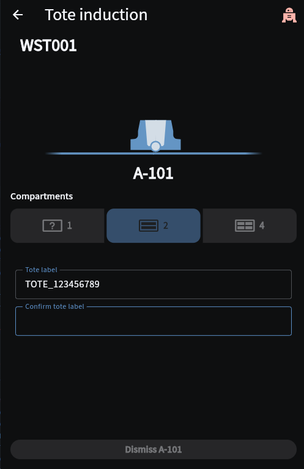
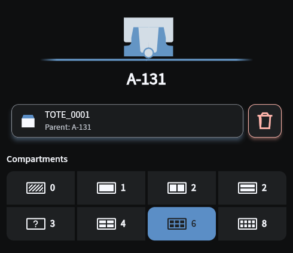
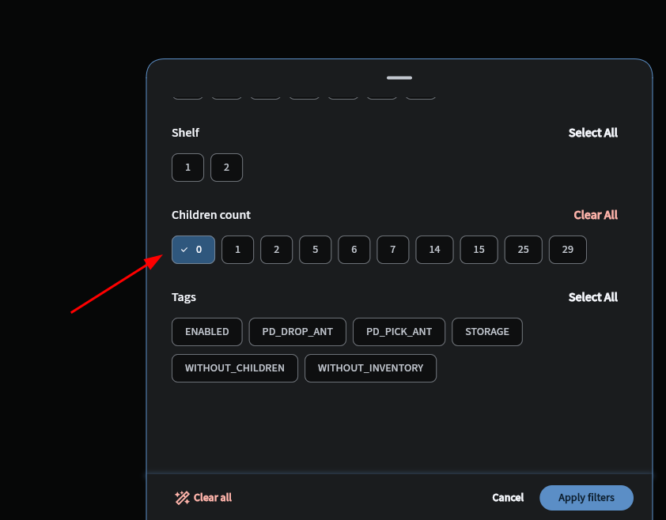
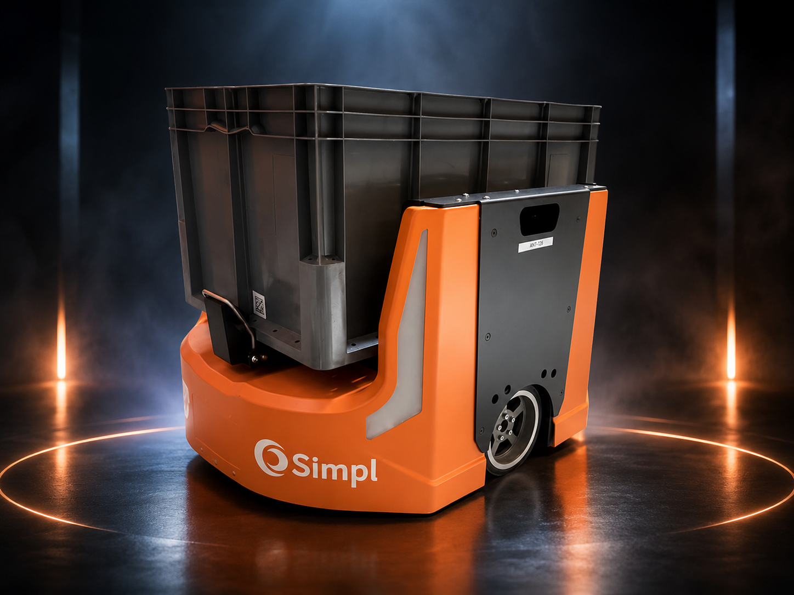
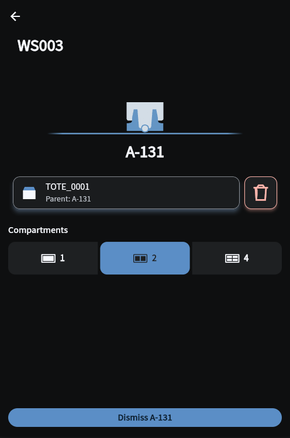
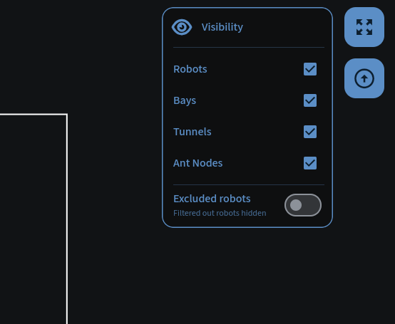

# SIMPLware Release Notes

## In scope
- SIMPL UIs: Flo and Puls
- SIMPL Kotlin and Python backend services
- SIMPL Kotlin, Python, and Flutter SDKs
- Robot firmware

## Out of scope
- Software infrastructure
- Robot mechanics
- Layout and physical infrastructure

> **NOTE**: SIMPL ticket numbers look like this: [#1234]

# v3.0.4 - Bug bash + Better Tote Induction

2026.07.25

## ✨ Shiny new stuff
Sorry, just the shiny old stuff for now 〰️

## ⏫ Level-ups
### ➕ Improved tote induction workflow [#7727]
Flo has a more intuitive and less error-prone tote induction workflow!

- Compartment selection is first now, since totes are automatically created after verifying barcodes
- Compartment selection and Ant dismiss buttons are disabled during in-flight operations to prevent accidental presses
- When teleporting a tote from the Orphanage, Flo will auto-select the compartment configuration for that tote
- After scanning a tote that already exists in the system (other than orphans), the warning snackbar must now be manually dismissed with the X button so you can take note of the scanned tote and its current location

## 🪲 Bug fixes
- Mantises and Ants should no longer go offline due to lack of frequent-enough MQTT heartbeats [#7410]
- The Mantis fullness calculation has been improved, which should result in better distribution of totes during Tote Induction [#7826]
- Ants should no longer take longer than expected to start moving again after dropping off a tote with inventory into a P&D [#7731] [#7813]
- Flo no longer inaccurately reports that an empty Ant is carrying a tote after presenting during Tote Induction [#7712] [#7715]
- Flo no longer allows the accidental deletion of totes after dismissing Ants during Tote Induction [#7675] [#7684]
- Totes in the Orphanage now accurately show in Flo on the Orphanage Detail screen [#7861]
- The select-all button on the Layout screen now only selects robots that are visible in the card list (excludes filtered robots) [#7860]
- Flo no longer blocks you from entering the Tote Induction Operations screen sometimes after starting Tote Induction at a workstation [#7611] [#7766] [#7808]
- Flo now shows empty compartment demand correctly, instead of as "Empty totes" [#7800]
- Flo no longer shows the "hamburger" icon for 600✕200 compartments on the Tote Detail screen [#7835]
- Compartments are now tappable from the Tote Detail screen [#7852] [#7807]
- The robots filter button is now shown on the robots side sheet on mobile [#7860]

## 🤖 Firmware updates
No firmware updates required! ✅

## 🧪 Development improvements
Nothing to see here 🙈

## 🚧 Known issues
- Ants sometimes need to be manually rebooted due to infinite reconnect attempts [#7760]
- Ants sometimes overshoot their target commanded position, causing overlapping reservation gridlocks [#7820] [#7842]
- The Flo layout is a bit sluggish when tunnels are visible [#7821]
- On the Flo Area screens, incoming transfers are not visible until the first Ant arrives at the workstation [#7821]
- Workstations sometimes show as Off in Flo when Tote Induction is enabled [#7779]

## 🚀 Deployment notes
- **New robot firmware?**: YES
- **New Flo APK?**: v4.5.16
- **New backend services**: NONE
- **Updated backend services**: AVS, CVS, IMS, RMS, SASG
- **Database migrations**: NONE
- **Downtime requirements**: 1 hour of full system downtime

# v3.0.3 - Ant traffic school

2026.07.20

## ✨ Shiny new stuff
Sorry, just the shiny old stuff for now 〰️

## ⏫ Level-ups
### 🌭🍔 Hot dogs and hamburgers
Flo now supports both **hot dog** and **hamburger** tote compartment configurations.

- Flo also supports fully **empty totes** without compartments, **single compartment** totes, as well as **quad**, **hex**, and **oct** compartment configurations
- Custom compartment icons during tote induction are also **bigger** so it's easier to see which compartment configuration you are selecting
- Flo will also **remember** the last compartment selection you used **by workstation** until you restart the app

## 🪲 Bug fixes
- Ants should no longer collide with Mantises while the Mantis is extracting [#7763]
- Ants should no longer fail tasks due to "Failed to find transition position for request" [#7473] [#7741]
- Ants should no longer periodically stop while driving long distances [#7743]
- Ants no longer get close enough to gridlock each other in certain cases [#7713] [#7756]
- Empty Ants should now distribute more evenly between multiple workstations based on WIP calculations [#7749] [#7729]
- Ants should no longer get stuck at the position just before the presentation position in a workstation [#7750] [#7767]
- Ants carrying totes with compartments other than the compartment types currently being requested by the workstation should now auto-dismiss after presenting [#7755] [#7775]
- Dynamic Pick Stations should now request the right number of totes and Ants [#7709]
- Totes that already exist in the system can no longer be teleported during Flo Tote Induction unless they are in the Orphanage [#7721] [#7723]
- The Flo container teleport destination selection bottom sheet should now show all eligible bays during selection [#7279]
- After creating, deleting, and re-creating a tote during Flo Tote Induction, tote compartments no longer inaccurately show DELETED in Flo [#7667]
- During Flo Tote Induction, Flo no longer inaccurately reports that an empty Ant is carrying a tote (the previous tote the Ant inducted) [#7777]

## 🤖 Firmware updates
No firmware updates required! ✅

## 🧪 Development improvements
- DPS environment variables have been corrected in Helm [#7794]

## 🚧 Known issues
- The order of operations in Flo Tote Induction is a little wonky [#7727]
- Flo Tote Induction allows you to delete a tote on an Ant after dismissing the Ant [#7684]
- Compartment-specific demand shows as "Requesting empty totes" in Flo [#7800]
- Workstations sometimes show as Off in Flo when Tote Induction is enabled [#7779]
- Sometimes Flo Tote Induction is stuck in a Pending status [#7766]
- Ants sometimes take longer than expected to start moving again after dropping off a tote with inventory into a P&D [#7744]
- Sometimes compartments are not tapable in Flo and show the incorrect icon [#7807]

## 🚀 Deployment notes
- **New robot firmware?**: NO
- **New Flo APK?**: YES
- **New backend services**: NONE
- **Updated backend services**: AMS, CVS, DPS, GAS, IMS, LM, RCS, RES, RMS, RQS, SASG
- **Database migrations**: See note below
- **Downtime requirements**: 30 minutes of full system downtime

For the **new compartment icons** to work correctly in Flo, you'll need to make sure your container templates are configured with the following **valid labels**. Anything outside of these labels will show a ? compartment icon in Flo.
- EMPTY_TOTE
- STUDIO
- HAMBURGER
- HOTDOG
- QUAD
- HEX
- OCT

# v3.0.2 - Hot dogs for the children

2026.07.16

## ✨ Shiny new stuff
Sorry, just the shiny old stuff for now 〰️

## ⏫ Level-ups
### 🌭 Added support for "hot dog" totes [#7716]
SIMPLware now supports totes with 2 long rectangular compartments.

- See [Known issues](#-known-issues) below

### #️⃣ Children count filter in Flo
Flo has a new children count filter on the Containers screen, allowing users to filter containers by their children count.

## 🪲 Bug fixes
- Reduced the number of times Ants need to be cleared while stalled in the Storage area [#7730]
- Ants no longer get close enough to gridlock each other (still) [#7738]
- Ants no longer stay unreasonably far away from each other (better command shortening) [#7711]
- Ant tasks no longer fail with "Failed to find transition position for request" errors when entering workstations [#7710]
- Flo no longer reports "Depositing to undefined" on some Ant deposit tasks [#7502]
- The time it takes for an Ant to start moving again after dropping off a tote with inventory into a P&D has been reduced [#7735]
- Pressing Enter after entering a tote label on the Containers screen now immediately searches for the tote instead of changing focus to the Find container button [#7659]
- The deletion of totes during Flo Tote Induction now properly updates other devices monitoring the Tote Induction Operations screen [#7665]

## 🤖 Firmware updates
No firmware updates required! ✅

## 🧪 Development improvements
Nothing to see here 🙈

## 🚧 Known issues
Ghost town 👻

## 🚀 Deployment notes
- **New robot firmware?**: NO
- **New Flo APK?**: YES
- **New backend services**: NONE
- **Updated backend services**: AMS, CVS, DPS, GAS, IMS, RES, RVS, SASG
- **Database migrations**: NONE
- **Downtime requirements**: 30 minutes of full system downtime

# v3.0.1 - Couple bug fixes

2026.07.15

## ✨ Shiny new stuff
Sorry, just the shiny old stuff for now 〰️

## ⏫ Level-ups
Steady as she goes 🚢

## 🪲 Bug fixes
- Ants no longer get close enough to gridlock each other [#7677]
- Totes are now able to be correctly picked up from DPS workstations [#7688]
- Ants no longer get stuck when entering DPS workstations [#7700]
- Ants now correctly choose their closest transition nodes [#7676]
- MQTT connectivity fix for Puls analytics [#7689]
- Some SENSOR_INITIAL_STATE_CHECK_FAULT failures have been resolved [#7663]

## 🤖 Firmware updates
No firmware updates required! ✅

## 🧪 Development improvements
Nothing to see here 🙈

## 🚧 Known issues
Ghost town 👻

## 🚀 Deployment notes
- **New robot firmware?**: NO
- **New Flo APK?**: NO
- **New backend services**: NONE
- **Updated backend services**: AMS, DPS, LM, POP, PUT, RES
- **Database migrations**: NONE
- **Downtime requirements**: 30 minutes of full system downtime

# v3.0.0 - Enter: Ant 3.0

2026.07.13

## ✨ Shiny new stuff
### 🏎️ Ants just got a lot faster [#6137]
Introducing, the new super speedy Ant management stack!

- The **time Ants have to wait** to be told what to do next has been dramatically reduced to **near zero**
- The new **Ant Management Service (AMS)** combines the functionality of robot **tasks**, **actions**, and **commands** into one, super fast, infinitely scalable, Ant conductor!
- AMS creates Ant "actors" under the hood that manage each Ant individually in memory
  - Ants are assigned to instances of AMS during deployment
  - This allows AMS to handle an **unlimited** number of Ants; the only limitation is the hardware you throw at it!
- Ant 3.0 **firmware** is more **autonomous**
  - Previously, commands were deterministic and required a final velocity to be passed
  - This resulted in commands constantly being planned and overwritten as an Ant progressed through a task
  - With the new stack, commands are planned for tasks by **appending** new commands, drastically reducing the number of commands that need to be sent to the Ants
- **Layout Manager (LM)** has been overhauled
  - LM is no longer simply an AutoCAD translator, it is a fully fledged **path planning powerhouse**!
  - Layout creation now has more accurate graph traversal according to AutoCAD properties
  - Valid orientations for traffic control are now read directly from the AutoCAD import, improving **path planning efficiency**
- **Reservation Execution Service (RES)** is a new service that exclusively handles the creation, management, and validation of **reservations** for all robots
  - Reservation management is now fully in-memory, making it **lightning fast**!

### 🗃️ Optimize product footprint with tote compartments! [#6699]
SIMPLware now enables storing many **different products** in a **single tote**!

- **Container templates** can be added to the system to configure tote compartments in a variety of ways
- Tote **orientations are tracked** as totes move around the system to enable optimized presentation at GTP workstations

### ➕ Induct totes with Flo! [#7017]
Flo has a new **Tote Induction screen** which allows users to easily induct totes into the system from GTP workstations!

- From the **Areas screen**, select a workstation then press the **Play button** in the Tote Induction section to start requesting empty Ants to the workstation
- With Tote Induction enabled, tap the **Tote Induction card** to enter the Tote Induction Operations screen
- While on the Tote Induction Operations screen, Flo will walk you through the process of adding new totes into the system
  - Simply **scan both labels** on the tote, select your **compartment** configuration, then press the **Ant dismiss** button or scan the Ant dismiss **QR code** to send the Ant away and load your next tote!

## ⏫ Level-ups
### 👁️ Flo layout visibility [#7560] [#7559] [#7527]
The Flo Layout screen has a new expandable **visibility menu**!

- Tap the **eyeball icon** on the Layout page to expand or collapse the new menu
- With the new menu, you can show/hide Robots, Bays, Tunnels, and Ant Nodes in the layout
- That's right, I said **Tunnels**! Inaccessible and disabled tunnels now render on the Layout screen too!
- There is also an **"Excluded robots" switch**, which, when enabled, will display all robots in the layout, even if they are **filtered out** on the robot card list!

## 🪲 Bug fixes
- Mantis homing code capture now starts correctly [#7428] [#7503]
- Totes can now be successfully picked up and dropped off at DPS stations [#7156] [#7664] [#6390] [#6731]
- Inventory updates are now processed faster [#7225]
- Workstations no longer sometimes request an incorrect number of empty totes or robots [#7463] [#7413]
- Shelf offsets are now collected more accurately [#7628]
- Ants now deposit to the closest available P&D locations [#7600]
- Offline robots turn grey in Flo [#7566]
- Flo's Areas screen and Workstation Detail screen now show accurate, up-to-date information for Areas [#7557]
- Bays on Flo's Layout page now render with the correct orientation on all layouts [#7274]
- Empty Ant incoming transfers now show correctly in Flo's Area Detail page [#7347]
- Flo no longer shows an incorrect container enabled/disabled state sometimes [#7500]

## 🤖 Firmware updates
### Mantis 2.5
- NXP: `v1.11.1-1-gb56fc09`
- Wormhole: `2.1.6`
- ALL-CAN 4: `f1a3258`
- ALL-CAN 8: `a903e43`
- Arm motor: `25072501`
- Finger motor: `v33.5`
- Foot motor: `3457`
- Scanner: Unknown [#7801]

### Ant 3.0
- NXP: `v0.13.0-5-g9290418`
- Wormhole: `2.1.6`
- ALL-CAN 4: `cf2697e`
- Mover motor: `26011601`
- Lifter motor: `26031501`
- Scanner: `V1.003.0001.1.R.20250924-1894`

## 🧪 Development improvements
- Modernization of the ACAR service; converted to the SIMPL SDK [#6055]
- Modernization of the CRS service; converted to the SIMPL SDK [#3496]
- Modernization of the AVS service; converted to the SIMPL SDK [#5872]
- Our analytics platform now collects more on-site data for analysis [#7617]
- Various service changes to support the new robot tasking stack [#6700] [#7009] [#7015]
- Firmware changes to support the new robot tasking stack [#6896]
- Improved automated testing in QA [#6355]
- RAS now publishes success/failure Kafka message for robot mode change requests [#7191]
- New Kafka topics for configuring GASConfig and GASState [#6850]
- SIMPL SDK now supports Mantis containers [#7124]
- Tagging of inaccessible tunnels can now be turned off via an SASG env var [#7526]
- The state of robot queues is now exportable via a new IOCS API and internal Kafka API [#7593]
- RAS and GAS consume Kafka messages faster [#7616] [#7512]
- URS service has been deprecated [#7232] [#7224]
- Patching of existing objects in Redis has gotten faster when writer ports in the SIMPL SDK opt-in to patching [#7223]
- New Simpl Spring Redis Periodic SDK library uses Redis to help services coordinate periodic reconciliation across multiple replicas [#7109]
- RVS is now horizontally scalable [#7180]
- RAP service helps debug onboard robot issues by automatically pushing robot logs to the cloud whenever a robot fails a task [#6320]
- Flo now has a new debugging menu to enable additional logging at runtime accessible on desktop with Cmd/Ctrl+Shift+D
- RVS now throws out stale robot status updates at startup [#7415]
- Flo now shows an in progress indication while Mantis bay assignment changes are processing [#7393]

## 🚧 Known issues
Ghost town 👻

## 🚀 Deployment notes
- **New robot firmware?**: YES
- **New Flo APK?**: YES
- **New backend services**: AMS, DPS, RES
- **Updated backend services**: ACAR, AVS, CRS, CTB, CTS, CVS, GAS, GDS, IMS, ITS, LM, LVS, RAP, RAS, RMS, RQS, RSS, RVS, SASG, SOS
- **Database migrations**: YES
- **Downtime requirements**: 1 hour of full system downtime

<a class="archive-releases-btn" href="#/archive">🗃️ Archived releases</a>
