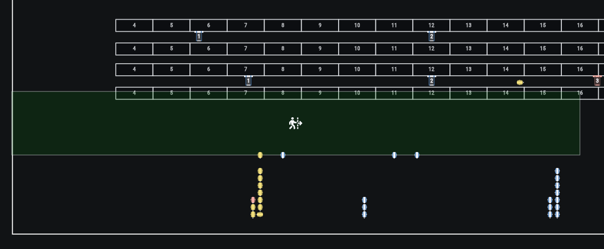
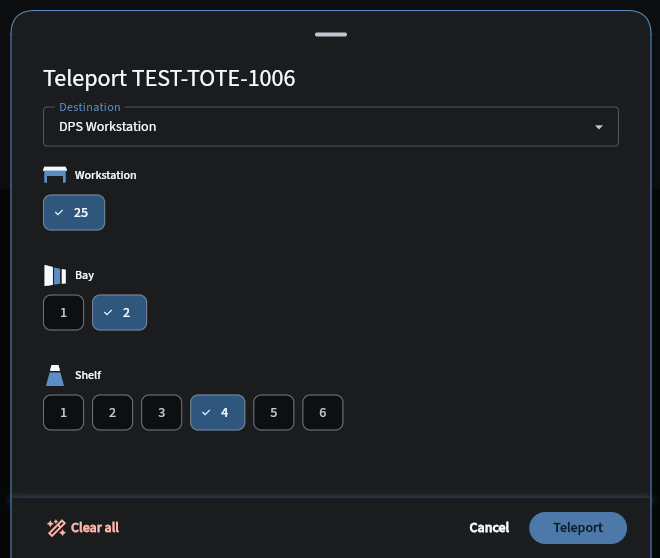

# Upcoming Release

There's a new release that will be ready soon! These release notes are **incomplete** and **subject to change**.

# v3.1.2 - TBD

2026.09.08

## ✨ Shiny new stuff
Sorry, just the shiny old stuff for now 〰️

## ⏫ Level-ups
### 💪 Flo enhancements
Flo is now more **stable**, **accurate**, and **performant**!

- Updates to the Areas and Area Detail screens in Flo are faster [#7978]
- Flo now only allows you to have a single Flo browser tab open at a time to ensure Flo doesn't use too many resources on your device [#8276]
- Tapping the robot alert icon now removes any previous filters you had applied [#7828]
- Task creation failures now show separately from task failures in Flo [#8214]
- Flo no longer freezes for several minutes at startup [#8252]
- Several Flo cache issues have been fixed due to Flo sometimes missing push updates during brief device disconnects. This is expected to resolve Flo presenting outdated information throughout the app, including Container enablement and Safety Zone lock states [#8328] [#8324]
- Flo no longer sometimes inaccurately reports that an Ant has a tote onboard after it presents during Tote Induction [#8190]
- Flo no longer sometimes shows that workstations are "Requesting" something when they are not [#7036]
- Flo no longer allows Ants to carry more than one tote in some cases during Tote Induction [#8057] [#8062]

### 🦺 Keep an eye on locked Safety Zones [#8239]
Locked safety zones are now **always visible** in the Flo Layout screen.

<!--  -->

### 📦 Flo teleport enhancements [#8289] [#8277]
Flo now supports teleporting totes to Storage P&Ds and DPS Workstation shelves

<!--  -->

### 🚦 Ant failure detours [#8316]
Ants will now take **detours** around other Ants that have **failed tasks**.

## 🪲 Bug fixes
- Ants don't wait as long under P&Ds after dropping off totes with inventory [#8191] [#7228]
- Ants no longer travel to invalid locations due to incorrect destination shortening [#8261] [#8280]
- Ants no longer get stuck entering workstations due to various issues [#7824] [#8290] [#8288]
- Workstations no longer receive extra empty containers at startup in some cases [#8187] [#8317]
- Ants no longer get stuck after being cleared while exiting DPS workstations [#8193]
- Tote orientations are now correctly emitted in `tote.moved` Kafka messages [#8295]

## 🤖 Firmware updates
TBD
<!-- ### Ant 3.0
- NXP: `Ant-hwE1-v0.16.0-3-g0bdd5eb`
- Wormhole: `v2.1.8-20260826` -->

## 🧪 Development improvements
- All logs from all bots are now published to the Puls environment from the new BLT service [#6143] [#7634] [#7733]
- Performance improvements for GAS and DPS container move processing [#8031]
- Workstations are now configured correctly in QA environments [#7658]

## 🚧 Known issues
TBD
<!-- - Flo sometimes inaccurately reports that an Ant has a tote onboard after it presents during Tote Induction [#8190]
- Flo does not make a visual distinction between task failures and task creation failures [#8214]
- Totes sometimes get stuck in P&D locations [#8125]
- Robots cannot be manually moved while inside locked Safety Zones [#8226]
- Clicking the robot alert button in Flo does not remove previously added filters, often hiding robots that have problems until the filters are manually removed [#7828]
- Flo sometimes does not accurately reflect the state of a robot for a short time [#8021]
- Flo allows Ants to have more than one tote on them during tote induction in some cases [#8062]
- Ants do not detour around Mantises that are in Manual [#7288]
- Workstations sometimes show as Off in Flo when Tote Induction is enabled [#7779]
- IMS has some performance issues when tagging containers [#7228] [#6576] -->

## 🚀 Deployment notes
TBD
<!-- - **New robot firmware?**: YES
- **New Flo APK?**: v4.6.6
- **New backend services**: NONE
- **Updated backend services**: AVS, AMS, CTB, DPS, IMS, IOCS, ITS, LM, LVS, MOM, POP, RES, RMS, RVS, TOM
- **Database migrations**: NONE
- **Downtime requirements**: 1 hour of full system downtime -->
