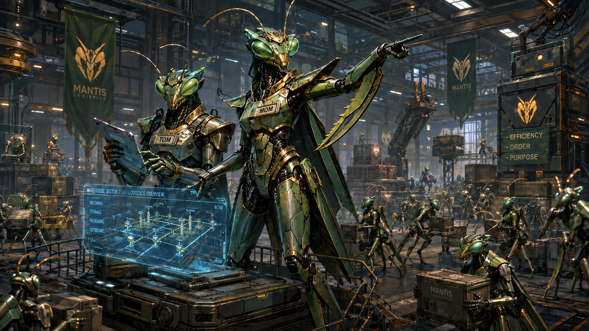

# Upcoming Release

There's a new release that will be ready soon! These release notes are **incomplete** and **subject to change**.

# v3.1.0 - Meet TOM and MOM

2026.08.16

## ✨ Shiny new stuff
### 🏎️ Mantises orchestration just got a lot faster [#7077]
Introducing **TOM** and **MOM**!

- The **time Mantises have to wait** to be told what to do next has been dramatically reduced
- The new **Tote Optimization for Mantis (TOM)** service continually **ranks totes** for Mantis extraction as conditions on the ground change
- The new **Mantis Orchestration Mothership (MOM)** service takes advantage of **TOM's pre-planning**, and is able to **quickly** tell Mantises what to do when they are **empty-handed**
- MOM also orchestrates the **Ants** within the **Storage area**, but there are no major improvements here; this is a 1-for-1 replacement of functionality **previously** handled by **SASG**
  - That's right, **SASG is no more**; TOM and MOM are the new Storage area commanders.

## ⏫ Level-ups
Steady as she goes 🚢

## 🪲 Bug fixes
- Workstations demanding totes that have been deleted will still receive Ants to fulfill other eligible demand at the workstation [#8086] [#8088]
- Lots of Ant gridlock fixes [#7673]
- Ants no longer fail tasks due to action reservation creation failures in RES [#8047]
- Ants no longer gridlock due to overlapping reservations caused by small command reservation buffers [#8032]
  - This buffer is now configurable in RES
- Robots should no longer be blocked by other robots that are not nearby due to hanging reservations caused by some SIMPLware upgrades as well as command validation request timeouts [#7713] [#7773] [#7762] [#8048]
- Ants no longer deliver totes to Mantises that don't have any more space available [#8009] [#8015]
- Ants no longer get stuck at workstations after being dismissed due to a class cast exception in the SIMPL SDK [#8113]
- Ant Exit tasks should no longer fail with "Error in command rejection handling" [#8064]
- Mantises no longer try to extract totes in other aisles due to bad indexing of compartments, causing large blockages of other robots [#8034] [#8035]
- Ants no longer fail to enter workstations due to lack of container ancestor check retries [#7824] [#8041]
- Mantis extract tasks should no longer fail with "Expected State: armPosition" during re-grab retries [#8076]
- Ants no longer consistently overshoot their target commanded positions, resolving several issues [#7439] [#7382] [#7461] [#7713] [#7820] [#7842]
- Robots no longer show as offline in Flo about once every 10 minutes [#7978]
- Containers on the Flo Containers screen are now sorted by number correctly [#7362]
- Kafka brokers are no longer being killed due to excessive memory consumption, resolving several issues [#7974] [#7975] [#7977] [#7976] [#8019]
- Compartment containers are no longer incorrectly cast to P&D Shelf containers in some edge cases in the SIMPL SDK, causing several issues [#8123]

## 🤖 Firmware updates
?????

## 🧪 Development improvements
- Various data improvements in the Puls ecosystem [#7890] [#6641]
- Auto-clear can now be configured through various Kafka topics [#8063]
- Bot log ingestion pre-work [#7546]
- Additional Puls analytics data ingestion [#8026] [#8066] [#8044] [#8110]
- Pre-work for future improvements to traffic control, detour logic, robot task replanning and integration with safety zone [#7431]
- Pre-work for future safety zone loading from CAD import [#7986] [#7555]
- Tons of pre-work for future authentication and support ticket features in Flo and Puls [#6531] [#6532] [#6569] [#6571] [#6574] [#6575] [#6577] [#6593] [#6594] [#6598] [#6668] [#6692] [#6716] [#6722] [#6723] [#6724] [#6811] [#6990] [#7652] [#6533] [#7917] [#8104] [#7891]
- Pre-work for being able to paint workstations in the Flo Layout screen [#7298]
- IOCS messaging enhancements [#7996] [#8079]
- Some SIMPL SDK exceptions are no longer swallowed [#7823] [#7841]
- WDS now rejects `workstation-demand.upsert` messages if the two `destinationWorkstationLabel` fields do not match [#7253]
- GAS now publishes `ant.dismiss.rejected` Kafka messages when consuming `ant.dismiss` messages for unknown workstations
- Updated `workstation-demand.upsert` validation logic for DPS stations [#7278]
- Waltham layout bug fixes [#6763]

## 🚧 Known issues
- On the Flo Areas screens, incoming transfers are not visible until the first Ant arrives at the workstation [#7836]
- Workstations sometimes show as Off in Flo when Tote Induction is enabled [#7779]

## 🚀 Deployment notes
- **New robot firmware?**: YES
- **New Flo APK?**: v4.6.1
- **New backend services**: MOM, TOM
- **Updated backend services**: ACAR, AMS, CTB, CTS, GAS, IOCS, LM, POP, PUT, RAP, RES, RMS, SASG, WDS
- **Database migrations**: NONE
- **Downtime requirements**: 1 hour of full system downtime

# v3.1.1 - Safer Zones + Faster TOM

2026.08.26

## ✨ Shiny new stuff
Sorry, just the shiny old stuff for now 〰️

## ⏫ Level-ups
### 🦺 Safety Zones are even better [#7986] [#7555] [#8122] [#8210] [#7661]
Safety Zones are now created directly from the building's **CAD file**!

- After a **new layout file** is loaded into the Layout Manager (LM) service, Safety Zones are **automatically re-loaded** into the system and **reflected in Flo**
- Safety Zone locks are now **near-instantly blocking**, causing all robots to **pause** when inside locked Safety Zones and **instantly blocking** any other robots from entering
- Several minor Flo enhancements have been made to make Safety Zones easier to understand and interact with

### 🏎️ Mantis tote selection enhancements [#8215] [#8204] [#8162] [#8127] [#8140]
TOM tote selection planning is now **faster** and **more accurate**!

- TOM now has an **optimized distance calculation**, calculating **accurate tote distances** from Mantises' current positions
- TOM **tote scoring** is significantly faster, leading to **more accurate** selection of totes for Mantis extracts
- MOM now considers **workstation WIP** when selecting totes for Mantis extracts
- TOM resource utilization has also been significantly reduced

## 🪲 Bug fixes
- The THD Pilot layout has some enhancements for Ant detours as well as Ant nodes removed for maintenance bays [#8209]
- Robots no longer fail tasks with "coordY" errors [#8133]
- Ants no longer fail tasks with "Error in command success handling" errors [#8161] [#8025]
- Ants no longer fail Exit tasks with "Replanning failed" errors [#8222] [#7438]
- Ants no longer fail DPS Exit tasks with pathing errors [#8201]
- Mantises no longer fail tasks with failure reasons equal to the name of the Mantis [#8198] [#8200]
- Mantises no longer sometimes fail tasks when blocked by locked safety zones [#8216]
- Mantises no longer fail tasks with "Expected state not match" errors when encountering end-of-arm sensor issues during a shuffle deposit [#8217]
- Mantis homing code capture is working again [#8153]
- Fixed some nav node reservation issues [#8207]
- Excess totes no longer arrive at workstations due to fast Mantis planning [#8188]
- Safety zone view toggling in Flo no longer resets your visibility settings [#7661]
- Flo now shows Ant task creation failures [#8027]
- Flo now shows accurate "Requesting" values on the Areas and Area Detail screens [#6994] [#7036] [#8158]
- Robots now show offline in Flo if your device does not receive any updates from SIMPLware within a certain amount of time [#7480]
- Container enablement is now respected for DPS locations [#8095]
- DPS stations no longer receive too many empty Ants, and clearing bots at DPS stations no longer causes Ant tasking problems [#8016]

## 🤖 Firmware updates
?????

## 🧪 Development improvements
- Container export now supports partial export via optional list of container labels [#8218]
- Robot-info topics are now supported by IOCS [#8011]
- Robots come back online in Flo faster after certain SIMPLware upgrades [#8020]
- Better planning time logging in TOM [#8197]
- MOM now uses planning ID in logs for easier diagnosis of issues [#8131]
- AMS has new Ant task status: REPLANNED [#8212]
- Gathering new analytics data into the Puls environment [#8182] [#8203]
- ITS Redis setup issues resolved [#8185]

## 🚧 Known issues
- Flo sometimes inaccurately reports that an Ant has a tote onboard after it presents during Tote Induction [#8190]
- Flo does not make a visual distinction between task failures and task creation failures [#8214]
- Totes sometimes get stuck in P&D locations [#8125]
- Robots cannot be manually moved while inside locked Safety Zones [#8226]
- Clicking the robot alert button in Flo does not remove previously added filters, often hiding robots that have problems until the filters are manually removed [#7828]
- Flo sometimes does not accurately reflect the state of a robot for a short time [#8021]
- Flo allows Ants to have more than one tote on them during tote induction in some cases [#8062]
- Ants do not detour around Mantises that are in Manual [#7288]
- On the Flo Areas screens, incoming transfers are not visible until the first Ant arrives at the workstation [#7836]
- Workstations sometimes show as Off in Flo when Tote Induction is enabled [#7779]
- IMS has some performance issues when tagging containers [#7228] [#6576]

## 🚀 Deployment notes
- **New robot firmware?**: ?????
- **New Flo APK?**: v?????
- **New backend services**: NONE
- **Updated backend services**: ?????
- **Database migrations**: NONE
- **Downtime requirements**: ?????

