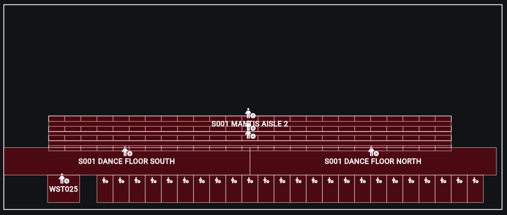
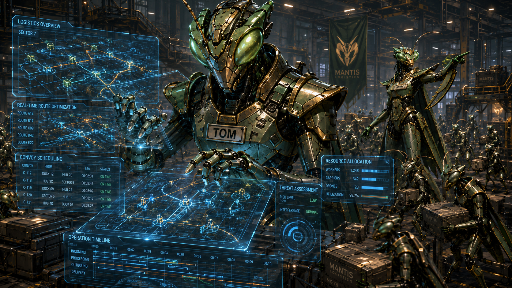

# Upcoming Release

There's a new release that will be ready soon! These release notes are **incomplete** and **subject to change**.

# v3.1.1 - Safer Zones + Faster TOM

2026.08.28

## ✨ Shiny new stuff
Sorry, just the shiny old stuff for now 〰️

## ⏫ Level-ups
### 🦺 Safety Zones are even better [#7986] [#7555] [#8122] [#8210] [#7661]
Safety Zones are now created directly from the building's **CAD file**!

- After a **new layout file** is loaded into the Layout Manager (LM) service, Safety Zones are **automatically re-loaded** into the system and **reflected in Flo**
- Safety Zone locks are now **near-instantly blocking**, causing all robots to **pause** when inside locked Safety Zones and **instantly blocking** any other robots from entering
- Several minor Flo enhancements have been made to make Safety Zones easier to understand and interact with

### 🏎️ Mantis tote selection enhancements [#8215] [#8204] [#8162] [#8127] [#8140]
TOM tote selection planning is now **faster** and **more accurate**!

- TOM now has an **optimized distance calculation**, calculating **accurate tote distances** from Mantises' current positions
- TOM **tote scoring** is significantly faster, leading to **more accurate** selection of totes for Mantis extracts
- MOM now considers **workstation WIP** when selecting totes for Mantis extracts
- TOM resource utilization has also been significantly reduced

## 🪲 Bug fixes
- The THD Pilot layout has some enhancements for Ant detours as well as Ant nodes removed for maintenance bays [#8209]
- Robots no longer fail tasks with "coordY" errors [#8133]
- Ants no longer fail tasks with "Error in command success handling" errors [#8161] [#8025]
- Ants no longer fail Exit tasks with "Replanning failed" errors [#8222] [#7438]
- Ants no longer fail DPS Exit tasks with pathing errors [#8201]
- Mantises no longer fail tasks with failure reasons equal to the name of the Mantis [#8198] [#8200]
- Mantises no longer sometimes fail tasks when blocked by locked Safety Zones [#8216]
- Mantises no longer fail tasks with "Expected state not match" errors when encountering end-of-arm sensor issues during a shuffle deposit [#8217]
- Mantis homing code capture is working again [#8153]
- Fixed some nav node reservation issues [#8207]
- Excess totes no longer arrive at workstations due to fast Mantis planning [#8188]
- Safety Zone view toggling in Flo no longer resets your visibility settings [#7661]
- Flo now shows Ant task creation failures [#8027]
- Flo now shows accurate "Requesting" values on the Areas and Area Detail screens [#6994] [#7036] [#8158]
- On the Flo Areas screens, incoming transfers are reflected faster when first turning on a workstation [#7836]
- Flo is more performant when loading containers for the first time after an update [#6768]
- Robots now show offline in Flo if your device does not receive any updates from SIMPLware within a certain amount of time [#7480]
- Container enablement is now respected for DPS locations [#8095]
- DPS stations no longer receive too many empty Ants, and clearing bots at DPS stations no longer causes Ant tasking problems [#8016]
- Ants no longer miss some startup NXP logs [#8105]

## 🤖 Firmware updates
### Ant 3.0
- NXP: `Ant-hwE1-v0.15.0-4-gb6c1310`
- Wormhole: `v2.1.8-20260826`

## 🧪 Development improvements
- Container export now supports partial export via optional list of container labels [#8218]
- Robot-info topics are now supported by IOCS [#8011]
- Robots come back online in Flo faster after certain SIMPLware upgrades [#8020]
- Better planning time logging in TOM [#8197]
- MOM now uses planning ID in logs for easier diagnosis of issues [#8131]
- AMS has new Ant task status: REPLANNED [#8212]
- Gathering new analytics data into the Puls environment [#8182] [#8203] [#8260]
- ITS Redis setup issues resolved [#8185]
- Ant firmware has some stricter version control [#8105]

## 🚧 Known issues
- Flo sometimes inaccurately reports that an Ant has a tote onboard after it presents during Tote Induction [#8190]
- Flo does not make a visual distinction between task failures and task creation failures [#8214]
- Totes sometimes get stuck in P&D locations [#8125]
- Robots cannot be manually moved while inside locked Safety Zones [#8226]
- Clicking the robot alert button in Flo does not remove previously added filters, often hiding robots that have problems until the filters are manually removed [#7828]
- Flo sometimes does not accurately reflect the state of a robot for a short time [#8021]
- Flo allows Ants to have more than one tote on them during tote induction in some cases [#8062]
- Ants do not detour around Mantises that are in Manual [#7288]
- Workstations sometimes show as Off in Flo when Tote Induction is enabled [#7779]
- IMS has some performance issues when tagging containers [#7228] [#6576]

## 🚀 Deployment notes
- **New robot firmware?**: YES
- **New Flo APK?**: v4.6.6
- **New backend services**: NONE
- **Updated backend services**: AVS, AMS, CTB, DPS, IMS, IOCS, ITS, LM, LVS, MOM, POP, RES, RMS, RVS, TOM
- **Database migrations**: NONE
- **Downtime requirements**: 1 hour of full system downtime
