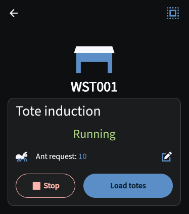
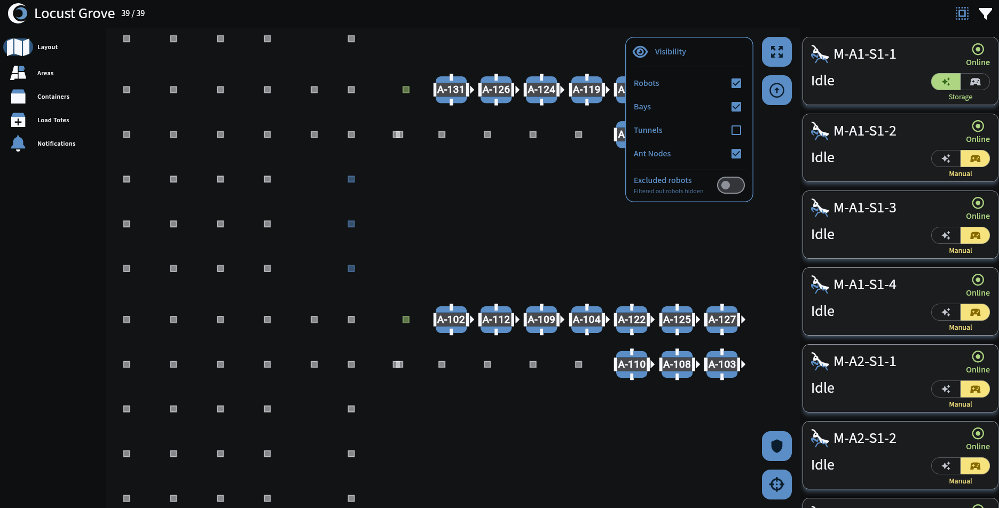

# Upcoming Release

There's a new release that will be ready soon! These release notes are **incomplete** and **subject to change**.

# v3.0.5 - Ants on demand

2026.08.05

## ✨ Shiny new stuff
Sorry, just the shiny old stuff for now 〰️

## ⏫ Level-ups
### ⚖️ Tote Induction Ant request control in Flo [#7734]
You can now **directly control** the number of Ants you would like to request at each workstation for Tote Induction in Flo!

- The **Tote Induction card** has gotten a bit of a **makeover** that makes controlling Tote Induction more intuitive
- Tap on the **Ant request tile** to set the number of Ants you would like to request for the workstation
- The Ant request setting can be updated **before** or **during** Tote Induction

### 🗺️ Flo Layout optimizations
The **Layout** in Flo has a couple of new improvements!

- When **targeting** a robot, Flo no longer **zooms** in really close to the robot (keeps your **current zoom** level)
- You can now see **Ant nodes** from **farther away**, and Ant node visibility is now **dynamically adjusted** based on the size of your screen
- **Tunnel visibility** is **disabled** by default to help with performance

## 🪲 Bug fixes
- Robots should no longer get stuck in gridlocks due to overlapping reservations [#7713] [#7927]
- Ants should no longer fail tasks with "Future state not match" errors when trying to move just after coming to a stop [#7904]
- Ants should no longer overshoot their target commanded position, causing overlapping reservation gridlocks and "Diff drive" task failures [#7842] [#7439] [#7382] [#7713] [#7461] [#7820]
- Ants should no longer need to be manually rebooted due to infinite reconnect attempts [#7737] [#7760]
- Totes tagged for pull quarantine will no longer be delivered to Workstations when the product in them is requested by the Workstation [#7936]
- Mantis Physical Audit should now work correctly [#7928] [#7929]
- Mantis P&D offset collection should now work correctly [#7922] [#7937]
- An additional confirmation dialog has been added to Flo when trying to shift an Ant into Manual while it is presenting at a workstation [#7933]
- During Flo Tote Induction, when an existing orphan tote is selected, the compartment selection now clears on all devices monitoring that workstation [#7945] [#7946]
- Totes with inventory can no longer be deleted unless the inventory is first deleted [#7919] [#7920] [#7865] [#7902]
- Some capitalization fixes in Flo [#7863]

## 🤖 Firmware updates
??????

## 🧪 Development improvements
- New Inventory Export API can be used to export inventory independent of containers [#7856]
- Additional Puls analytics data being collected for Ant task failures [#7839]
- SOS has been updated to the latest SIMPL SDK version [#7914] [#7921]
- Orphaning totes now produces `container.moved.RCS` and `tote.moved` Kafka messages [#7918]

## 🚧 Known issues
- On the Flo Area screens, incoming transfers are not visible until the first Ant arrives at the workstation [#7821]
- Workstations sometimes show as Off in Flo when Tote Induction is enabled [#7779]
- ??????

## 🚀 Deployment notes
- **New robot firmware?**: ?????????
- **New Flo APK?**: v?????????
- **New backend services**: NONE
- **Updated backend services**: AVS, CVS, IMS, ITS, POP, RES, SASG, SOS
- **Database migrations**: NONE
- **Downtime requirements**: 30 minutes of full system downtime
